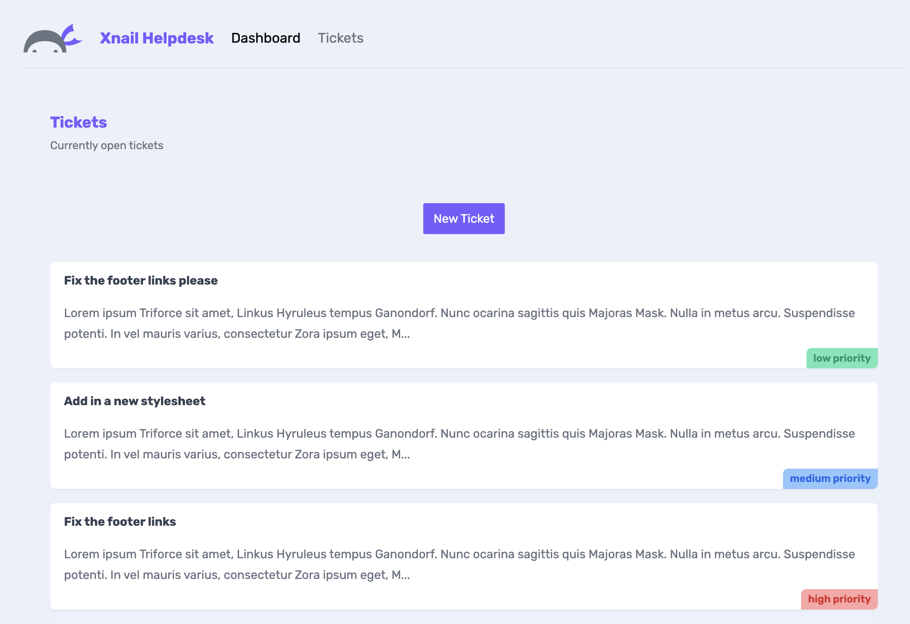

# NextJS_Tickets

Repository created following this [Youtube Course](https://www.youtube.com/watch?v=TJQbDPGzm0Y&list=PL4cUxeGkcC9jZIVqmy_QhfQdi6mzQvJnT&index=1&ab_channel=NetNinja) to practice the following basics of NextJS (v.13):

## Application

Application has a local database that contains tickets. Once we run the application we are displayed with the main page and we can go to the tickets page. There, we can click on any ticket to see its details and also create new tickets. Application is also handling the loading state, not found errors and some of the catching aspects



## Run Locally

Clone the project

```bash
  git clone https://github.com/pedrolopezbiedma/NextJS_Tickets.git
```

Install dependencies

```bash
  npm install
```

Start the server in another console

```bash
  npm run server
```

Start the application

```bash
  npm run dev
```

## Authors

- [@pedrolopezbiedma](https://github.com/pedrolopezbiedma)
